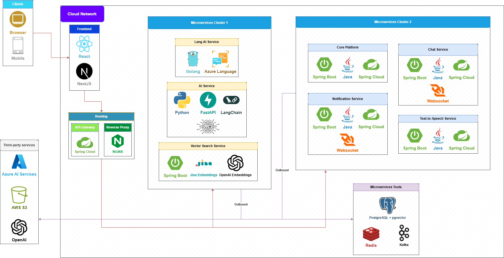

# VinaAcademy Microservices - Docker Swarm Deployment Guide

## 📋 Table of Contents

- [Overview](#overview)
- [Architecture](#architecture)
- [Prerequisites](#prerequisites)
- [Node Setup](#node-setup)
- [Environment Configuration](#environment-configuration)
- [Deployment](#deployment)
- [Management Commands](#management-commands)
- [Troubleshooting](#troubleshooting)

---

## Overview

This guide provides instructions for deploying the VinaAcademy microservices platform using Docker Swarm.

### Services Architecture

| Service                | Description                | Port              |
| ---------------------- | -------------------------- | ----------------- |
| eureka-server          | Service Discovery          | 8761              |
| api-gateway            | API Gateway                | 8080              |
| vinaacademy-platform   | Main Platform Service      | 8081, 9090 (gRPC) |
| notification-service   | Email/Notification Service | 8082              |
| chat-service           | Real-time Chat Service     | 8083              |
| text-to-speech-service | Text-to-Speech Conversion  | 8084              |
| vinaacademy-frontend   | Next.js Frontend           | 3000              |
| redis                  | Cache & Session Store      | 6379              |
| kafka                  | Message Broker             | 9092, 29092       |

### External Services (Cloud)

- **PostgreSQL**: Cloud database (AWS RDS, Azure Database, Supabase, etc.)
- **MinIO/S3**: Cloud object storage (AWS S3, MinIO Cloud, Cloudflare R2, etc.)

---

## Architecture



---

## Prerequisites

### Hardware Requirements

| Node | Name | RAM | Role |
|------|------|-----|------|
| Droplet A | vina-tools | 4GB+ | Databases, Message Broker, Discovery |
| Droplet B | vina-services | 8GB+ | Microservices, API Gateway, Frontend |
| Droplet C | vina-ai | 4GB+ | AI Models, Vector Search |

### Software Requirements

- Docker Engine & Docker Compose on all nodes
- Network connectivity between nodes (Public IPs or VPC)
- Access to external APIs (OpenAI, Gemini, Azure, Google, VNPay)

### Cloud Services Required

1. **PostgreSQL Database** with 3 databases:
   - `vinaacademy` - Main platform database
   - `vinaacademy_email` - Notification service database
   - `vinaacademy_chat` - Chat service database

2. **Object Storage** (S3-compatible):
   - MinIO, AWS S3, Cloudflare R2, etc.

---

## Node Setup

### Step 1: Install Docker

On all droplets (A, B, and C):

```bash
# Install Docker and Docker Compose
curl -fsSL https://get.docker.com -o get-docker.sh
sh get-docker.sh
```

### Step 2: Clone Repository

On all droplets:

```bash
git clone https://github.com/VinaAcademy/ms-ci-cd.git
cd ms-ci-cd
```

---

## Environment Configuration

### Step 1: Create Environment File

Create a `.env` file in the project root with the following variables:

```bash
# =====================================================
# DATABASE CONFIGURATION (Cloud PostgreSQL)
# =====================================================
POSTGRES_URL=jdbc:postgresql://<HOST>:5432/vinaacademy
POSTGRES_NOTIFICATION_URL=jdbc:postgresql://<HOST>:5432/vinaacademy_email
POSTGRES_CHAT_HOST=<HOST>:5432
POSTGRES_CHAT_DB=vinaacademy_chat
POSTGRES_USERNAME=<USERNAME>
POSTGRES_PASSWORD=<PASSWORD>

# =====================================================
# OBJECT STORAGE (Cloud MinIO/S3)
# =====================================================
MINIO_ENDPOINT=https://<MINIO_HOST>
MINIO_ACCESS_KEY=<ACCESS_KEY>
MINIO_SECRET_KEY=<SECRET_KEY>

# =====================================================
# GOOGLE OAUTH
# =====================================================
GOOGLE_CLIENT_ID=<YOUR_GOOGLE_CLIENT_ID>
GOOGLE_CLIENT_SECRET=<YOUR_GOOGLE_CLIENT_SECRET>
GOOGLE_REDIRECT_URI=http://<YOUR_DOMAIN>/api/v1/auth/oauth2/callback/google

# =====================================================
# VNPAY PAYMENT
# =====================================================
VNPAY_TMN_CODE=<YOUR_VNPAY_TMN_CODE>
VNPAY_HASH_SECRET=<YOUR_VNPAY_HASH_SECRET>

# =====================================================
# EMAIL SERVICE
# =====================================================
GMAIL_USERNAME=<YOUR_GMAIL>
GMAIL_PASSWORD=<YOUR_APP_PASSWORD>

# =====================================================
# SECURITY
# =====================================================
APPLICATION_HMAC_SECRET=<YOUR_HMAC_SECRET>

# =====================================================
# FRONTEND
# =====================================================
NEXT_PUBLIC_API_URL=http://<YOUR_DOMAIN>:8080/api/v1
NEXT_PUBLIC_SITE_URL=http://<YOUR_DOMAIN>:3000
NEXT_PUBLIC_WS_URL=http://<YOUR_DOMAIN>:8080/ws
```

### Step 2: Prepare Config Files

Ensure the following config files exist:
```
app-config/dev/
├── api-gateway-dev.yml
├── chat-service-dev.yml
├── notification-service-dev.yml
└── vinaacademy-platform-dev.yml
```

### Step 3: Prepare Keys

Ensure RSA keys exist for JWT:
```
keys/
├── private_key.pem
└── public_key.pem
```

Generate if not exists:
```bash
# Generate private key
openssl genrsa -out keys/private_key.pem 2048

# Generate public key
openssl rsa -in keys/private_key.pem -pubout -out keys/public_key.pem
```

---

## Deployment

This specific deployment guide uses **Docker Compose** on each independent droplet.

### Step 1: Configure Environment (.env)

1.  **On your local machine**, copy `.env.example` to `.env`.
2.  Update the IPs and credentials in `.env`.
    *   **Droplet A**: Set `DROPLET_A_IP` to its Public IP (for external access) or Private IP (if using VPC).
    *   **Droplet B**: Set `DROPLET_B_PUBLIC_IP` to its Public IP.
    *   **Droplet C**: Set `DROPLET_C_IP` to its IP.
3.  **Copy this `.env` file to ALL droplets** (A, B, and C) into the `ms-ci-cd` directory.

### Step 2: Deploy Droplet A (Tools)

Droplet A runs the foundational infrastructure services (Redis, Kafka, Postgres, Eureka).

1.  SSH into **Droplet A**.
2.  Navigate to the tools directory:
    ```bash
    cd ms-ci-cd/tools
    ```
3.  Start the services:
    ```bash
    docker-compose --env-file ../.env up -d
    ```

### Step 3: Deploy Droplet C (AI)

Droplet C runs the AI workload services.

1.  SSH into **Droplet C**.
2.  Navigate to the AI directory:
    ```bash
    cd ms-ci-cd/ai
    ```
3.  Start the services:
    ```bash
    docker-compose --env-file ../.env up -d
    ```

### Step 4: Deploy Droplet B (Services)

Droplet B runs the main application microservices.

1.  SSH into **Droplet B**.
2.  Navigate to the services directory:
    ```bash
    cd ms-ci-cd/services
    ```
3.  Start the services:
    ```bash
    docker-compose --env-file ../.env up -d
    ```

### Step 5: Verify Deployment

Check running containers on each droplet:

```bash
docker ps
```

---

## Management Commands

### Start/Stop Services

Run these commands inside the specific folder (`tools`, `services`, or `ai`) on the respective droplet.

```bash
# Start in background
docker-compose --env-file ../.env up -d

# Stop services
docker-compose down

# Restart a specific service
docker-compose restart <service_name>
```

### View Logs

```bash
# Follow logs for all services in the current compose file
docker-compose logs -f

# Follow logs for a specific service
docker-compose logs -f <service_name>
```

### Cleanup

```bash
# Remove containers and networks
docker-compose down

# Remove unused images
docker image prune -a
```

---

## Troubleshooting

### Common Issues

1.  **Connection Refused:**
    *   Ensure the IP addresses in `.env` are correct.
    *   Check if security groups/firewalls allow traffic on the required ports (e.g., 5432, 6379, 9092, 8761).

2.  **Service Not Healthy:**
    *   Check logs: `docker-compose logs <service_name>`
    *   Ensure dependent services are compliant (e.g., Platform needs Postgres/Redis).

### Health Check Endpoints

| Service | Health Check URL (Local) |
|---------|--------------------------|
| Eureka Server | http://localhost:8761/actuator/health |
| API Gateway | http://localhost:8080/actuator/health |
| Platform | http://localhost:8081/actuator/health |
| AI Service | http://localhost:8000/health |

---

## Quick Reference

| Droplet | Folder | Command |
|---------|--------|---------|
| **Tools (A)** | `cd tools` | `docker-compose --env-file ../.env up -d` |
| **Services (B)** | `cd services` | `docker-compose --env-file ../.env up -d` |
| **AI (C)** | `cd ai` | `docker-compose --env-file ../.env up -d` |


---

## Support

For issues and questions, please create an issue in the repository or contact the development team.
